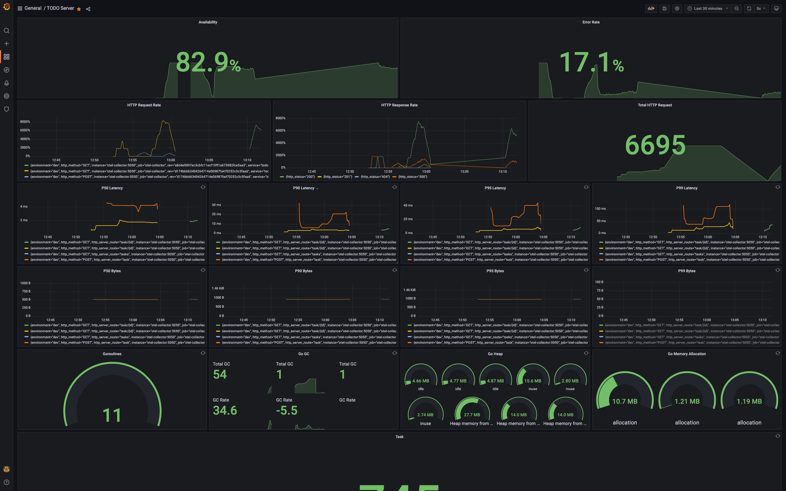

# TODO REST API Server

The server provides a REST API for managing tasks.

### Build:

```
git clone https://github.com/urvil38/todo-app-server.git
cd todo-app-server
make build
```

### Environment Variables:

| Name  |  Value  | Default Value  | Info
|:-----:|:---------------:|:--------------:|:---------|
|TODO_ADDRESS|0.0.0.0|localhost|Address on which server is running
|TODO_PORT|8080|8080|TCP port on which server is listening
|TODO_DEBUG_PORT|8081|8081|TCP port on which debug server is listening. Debug port should be different from the server port
|TODO_LOG_LEVEL|info, error, debug|info|LogLevel can be [info, debug, error, fatal]. If invalid log level is provided then info log level will be used as default
|TODO_LOG_FORMAT|text, json, json-pretty|text|LogFormat can be [json, json-pretty, text]
|TODO_DATABASE_HOST|localhost|localhost| DB Host Address
|TODO_DATABASE_USER|postgres|postgres| DB User
|TODO_DATABASE_PASSWORD|""|""| DB Password
|TODO_DATABASE_PORT|5432|5432| DB Port
|TODO_DATABASE_NAME|todo-db|todo-db| DB Name
|TODO_USE_DB|""|false|Whether to use postgres to store tasks or not. Default value is false, in that case tasks will be store in memory.

### Set Up local Postgres DB:

- Run postgres using docker

```
docker run -d -p 5432:5432 -e POSTGRES_PASSWORD=postgres -e LANG=C postgres:11.12
```

After running postgres, create database and migrate schema as following:

```
TODO_DATABASE_PASSWORD=postgres ./devtools/create_local_db.sh
```

### Run Server:

- Store tasks in memory

```
TODO_LOG_LEVEL=debug ./bin/todo-app-server
```

OR

- Store tasks in db

```
TODO_DATABASE_PASSWORD=postgres TODO_USE_DB=true TODO_LOG_LEVEL=debug ./bin/todo-app-server
```

## API

### Create Task:

```
curl --request POST \
  --url http://localhost:8080/v1/task \
  --header 'Content-Type: application/json' \
  --data '{"name": "task1"}'
```

### Get Task:

```
curl --request GET \
  --url http://localhost:8080/v1/task/1
```

### List Tasks:

```
curl --request GET \
  --url http://localhost:8080/v1/tasks
```

### Update Task:

```
curl --request POST \
  --url http://localhost:8080/v1/task/1 \
  --header 'Content-Type: application/json' \
  --data '{"name": "updated_task_1"}'
```

### Delete Task:

```
curl --request DELETE \
  --url http://localhost:8080/v1/task/1
```

## How to setup monitoring?

- There is a `docker-compose.yaml` available, which consists of jaeger, grafana, otel-collector and prometheus.

Start all the services by running following commands:
```
cd devtools
docker-compose -f docker-compose.yaml up
```

- **Grafana** will be available on: `http://localhost:3000`

- **Jaeger** will be available on: `http://localhost:16686/search`

- **Prometheus** will be available on: `http://localhost:9090`
<br></br>

Grafana Dashboard:
<br></br>

<br></br>
1. Import a dashboard `devtools/TODO-Server-grafana-dashboard.json` in grafana. 
2. In addition to that, you have to setup a prometheus datasource. Add prometheus URL `http://prometheus:9090` while configuring datasource.

## Debug Server:

- The server records metrics and traces. These are available on [http://localhost:8081](http://localhost:8081)